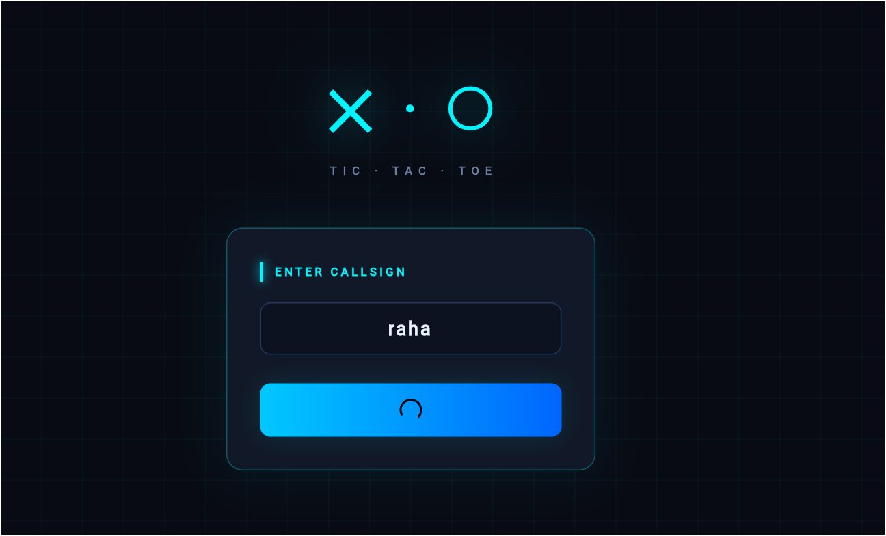
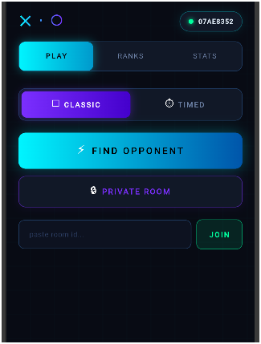
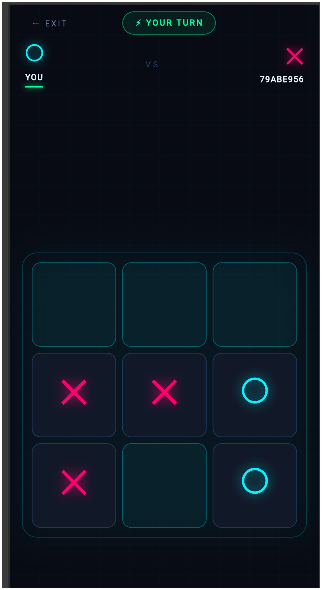
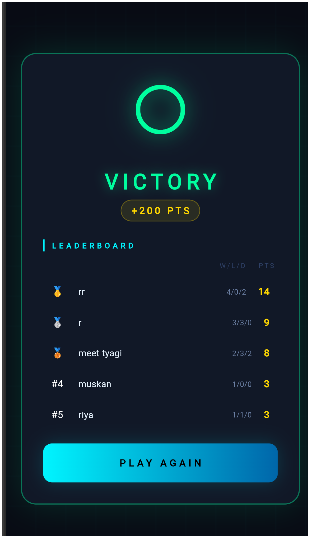

# ✕ · ○ Multiplayer Tic-Tac-Toe

A real-time multiplayer Tic-Tac-Toe game built with **Flutter** (web) and **Nakama** game server, featuring a cyberpunk neon UI, leaderboards, player stats, and private rooms.

---

## Live Demo

| Service | URL |
|---|---|
| Frontend (Netlify) | https://frabjous-gumdrop-3689b1.netlify.app/ |
| Nakama Server (Render) | https://nakama-server-sa0e.onrender.com |
---

## Features

- Real-time multiplayer via WebSocket
- Random matchmaking — find opponents instantly
- Private rooms — create and share a room ID
- Timed mode — 30 seconds per turn
- Global leaderboard with rankings
- Per-player stats (wins, losses, draws, streak, best streak)
- Cyberpunk neon dark UI with animations
- Persistent accounts via device ID

---

## Tech Stack

| Layer | Technology |
|---|---|
| Frontend | Flutter 3.x (Web) |
| Game Server | Nakama 3.x |
| Database | PostgreSQL 14 |
| Server Logic | JavaScript (Nakama runtime) |
| Containerization | Docker |

---

## Project Structure

```
tiatactoe/
├── tictactoe_flutter/          # Flutter frontend
│   ├── lib/
│   │   ├── main.dart           # App entry point
│   │   ├── nakama_service.dart # Nakama client service
│   │   ├── screens/
│   │   │   ├── nickname_screen.dart
│   │   │   ├── lobby_screen.dart
│   │   │   ├── finding_screen.dart
│   │   │   ├── game_screen.dart
│   │   │   └── winner_screen.dart
│   │   └── widgets/
│   │       └── app_colors.dart
│   └── pubspec.yaml
└── index.js                    # Nakama server module
```

---

## Prerequisites

- [Flutter SDK](https://flutter.dev/docs/get-started/install) `>=3.0.0`
- [Docker Desktop](https://www.docker.com/products/docker-desktop/)
- [Python 3](https://www.python.org/) (for writing server files)
- Google Chrome

---

## Getting Started

### 1. Clone / Set Up the Project

```
cd D:\mern\tiatactoe
```

### 2. Start the Backend (Docker)

Start PostgreSQL, Nakama, and the frontend container:

```powershell
docker start tictactoe-postgres-1 tictactoe-nakama-1 tictactoe-frontend-1
```

Wait ~15 seconds, then verify Nakama is running:

```powershell
docker logs tictactoe-nakama-1 --tail 5
```

You should see:
```
{"msg":"Startup done"}
```

### 3. Run the Flutter App

```powershell
cd D:\mern\tiatactoe\tictactoe_flutter
flutter pub get
flutter run -d chrome
```

The app will open in Chrome automatically.

---

## Stopping the Servers

```powershell
docker stop tictactoe-postgres-1 tictactoe-nakama-1 tictactoe-frontend-1
```

---

## Updating the Server Logic

The game logic lives in `index.js`. To deploy changes:

```powershell
docker cp D:\mern\tiatactoe\index.js tictactoe-nakama-1:/nakama/data/modules/index.js
docker restart tictactoe-nakama-1
```

---

## Flutter Dependencies

```yaml
dependencies:
  flutter:
    sdk: flutter
  nakama: ^1.3.0
  shared_preferences: ^2.2.2
  provider: ^6.1.1
```

---

## How to Play

1. Open the app in Chrome and enter a nickname
2. On the **Play** tab, choose **Classic** or **Timed** mode
3. Click **Find Opponent** — the server pairs you with another waiting player
4. Or click **Private Room** to create a room and share the Room ID with a friend
5. Take turns placing X or O — first to get three in a row wins
6. After the game, check your stats in the **Stats** tab and rankings in **Ranks**

---

## Game Server RPCs

| RPC | Description |
|---|---|
| `find_match` | Find or create an open match for matchmaking |
| `create_match` | Create a private match |
| `get_leaderboard` | Fetch top 50 global leaderboard records |
| `get_player_stats` | Fetch stats for the current player |

---

## Match OpCodes (WebSocket Messages)

| OpCode | Direction | Description |
|---|---|---|
| `1` | Server → Client | Game started |
| `2` | Both | Move made / send move |
| `3` | Server → Client | Game over |
| `4` | Server → Client | Error message |
| `5` | Server → Client | Timer tick |

---

## Scoring

| Result | Points |
|---|---|
| Win | +3 points |
| Draw | +1 point |
| Loss | 0 points |

---

## Known Limitations

- Web only (Flutter web build) — not yet packaged for Android/iOS
- Single device per account (device ID auth)
- No chat or friend system
- Nakama server must be running locally on `127.0.0.1:7350`

---

## Development Notes

The Nakama client used is `nakama 1.3.0` which requires:

- `NakamaBaseClient` (not `NakamaClient`) as the client type
- `sendMatchData` is `void` — do not `await` it
- Binary data must use `utf8.encode/decode` not `String.fromCharCodes`
- `onError` is a constructor callback, not a stream
- Storage `value` must be a plain Dart `Map`, not a JSON string


## Screenshots

| Login | Lobby | Game |
|---|---|---|
|  |  |  |

| Winner | Rankings |
|---|---|
|  |  |

